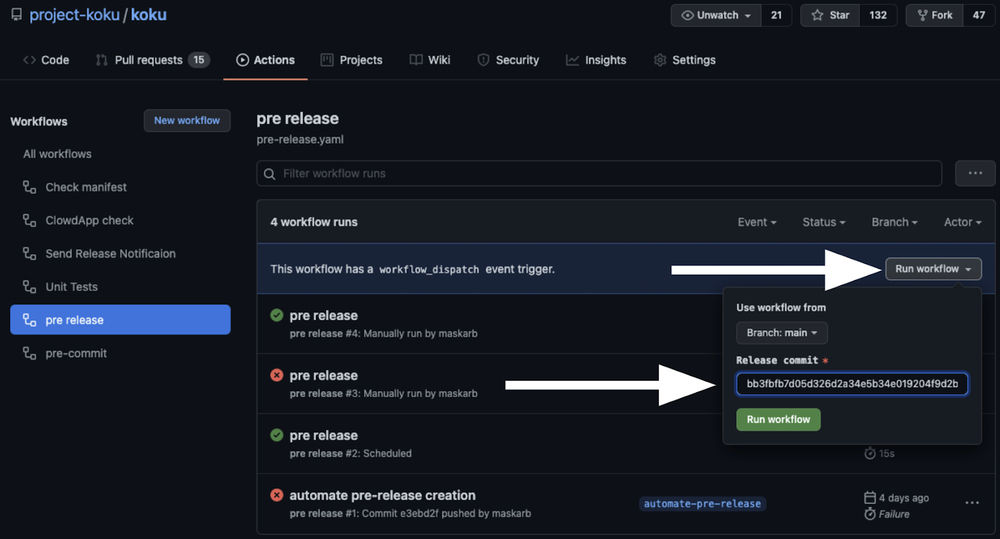
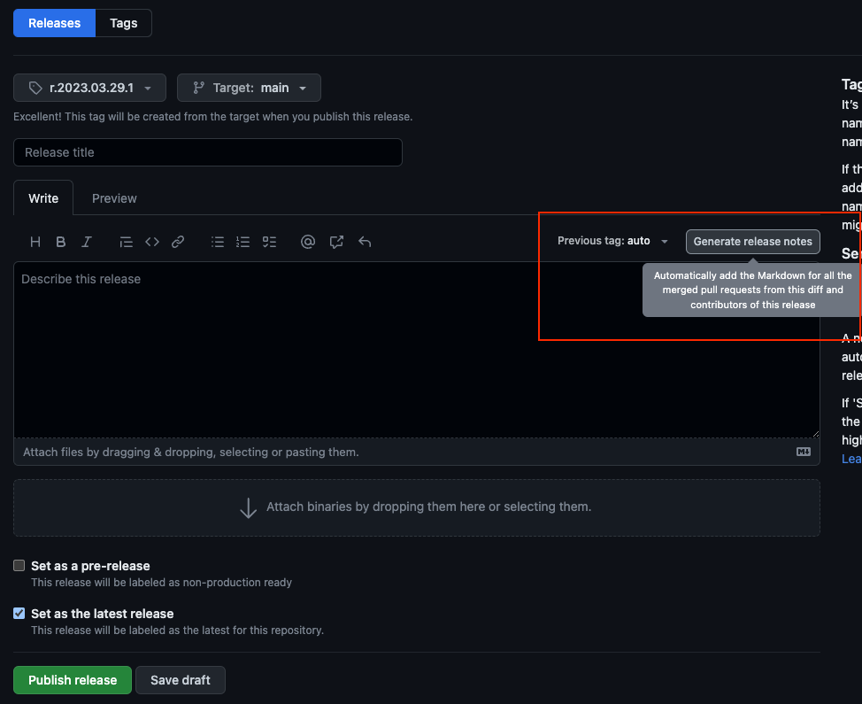

# Generating Release Notes

Under [actions](https://github.com/project-koku/koku/actions), select the [Create Pre-Release](https://github.com/project-koku/koku/actions/workflows/pre-release.yaml) action on the left. Click the **Run workflow** dropdown and enter the full commit hash for the commit pushed into Production. Select Run workflow, and after a few seconds, the action will run.

This action publishes a [Pre-release](https://github.com/project-koku/koku/releases). Select the newly created pre-release and auto-generate the release notes. Auto-generating the notes will add a **What's Changed** section listing each commit since the last release and a link to the full changelog.

The release engineer will fill in a high level summary of the changes that were released by replacing **TODO: insert summary**. Once done writing the summary, uncheck **Set as a pre-release** and check **Set as the latest release**.
