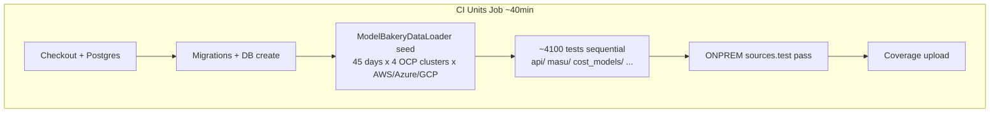
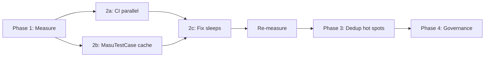

# CI Unit Test Performance Audit Plan

Audit and reduce the ~40-minute GitHub Actions unit test job through baseline
profiling, low-risk CI/runtime optimizations, and targeted consolidation of
redundant provider-parity tests — without weakening coverage on real behavior.

## Tracking

| Phase | Task | Status |
|-------|------|--------|
| 1 | Add `--timing` to CI and extend `KokuTestRunner` to log setup/seed duration; produce ranked slow-test report | Pending |
| 2a | Enable `--parallel` in `ci.yml` with coverage combine; fix any flaky tests from parallel execution | Done |
| 2e | Overlap ONPREM pass with parallel sharding via CI matrix | Done |
| 2b | Cache provider lookups in `MasuTestCase.setUpClass` to eliminate per-test DB queries | Pending |
| 2c | Replace `time.sleep(3)` in `test_tasks.py` with cache TTL mocking | Pending |
| 3a | Extract shared serializer validation tests into parametrized common module; remove duplicates from provider files | Pending |
| 3b | Audit query-handler shared tests (`exclude_tags`, `multi_exclude`, etc.) and consolidate base-class coverage | Pending |
| 4 | Add slow-test threshold warning and test-tier documentation to `docs/agent/testing.md` | Pending |

---

## Current State

The CI **Units - 3.11** job in [`.github/workflows/ci.yml`](../../.github/workflows/ci.yml) runs:

1. Full Django suite: `coverage run ./koku/manage.py test ./koku/` (sequential, no `--parallel`)
2. Second pass: `sources.test` with `ONPREM=True`

**Scale:** ~268 test files, ~4,100 test methods, ~94k lines of test code.

**No timing infrastructure exists today** — we are optimizing blind. The Postgres service is already tuned for parallelism (`max_connections=1710` in [`.github/postgres/docker-compose.yaml`](../../.github/postgres/docker-compose.yaml)), and [`KokuTestRunner`](../../koku/koku/koku_test_runner.py) supports `clone_test_db` when `--parallel` is used, but CI does not use either.



### Where time likely goes (hypothesis — must validate)

| Bucket | Evidence | Est. share |
|--------|----------|------------|
| DB setup + seed | [`KokuTestRunner.setup_databases()`](../../koku/koku/koku_test_runner.py) loads 45 days via [`ModelBakeryDataLoader`](../../koku/api/report/test/util/model_bakery_loader.py); CI has no persistent DB (`KEEPDB` irrelevant on ephemeral runners) | 5–15 min |
| Per-test DB overhead | ~288 `MasuTestCase`/`IamTestCase` classes; [`MasuTestCase.setUp()`](../../koku/masu/test/__init__.py) runs 8+ provider queries per test | 30–50% of execution |
| Heavy integration suites | Query handlers (404 tests, 13k lines), OCP cost-breakdown (253 tests, 8k lines), `test_tasks.py` (1.9k lines) | 25–40% of execution |
| Redundant parity tests | Same serializer validation copied across 6+ provider files | Low per-test, high aggregate |
| Artificial delays | 3x `time.sleep(3)` in [`test_tasks.py`](../../koku/masu/test/processor/test_tasks.py) | ~9 sec (trivial but fixable) |

---

## Phase 1: Measure (1–2 days, no test removals)

**Goal:** Produce a ranked slow-test report from a real CI-equivalent run.

### 1a. Add timing to CI (temporary or permanent)

Django 5.2 supports `--timing`. Update the Units job to capture slow tests:

```bash
pipenv run coverage run ./koku/manage.py test --noinput --verbosity 2 --timing ./koku/ 2>&1 | tee test-timing.log
```

Also extend [`KokuTestRunner`](../../koku/koku/koku_test_runner.py) to log:

- Migration duration
- `ModelBakeryDataLoader` seed duration
- Total test execution duration

### 1b. Run a profiling branch

On a branch (or `workflow_dispatch`), run the full suite locally mirroring CI env (`KEEPDB` unset, fresh DB, `ONPREM` second pass) and collect:

```bash
# Split timing by app to find sharding boundaries
pipenv run coverage run ./koku/manage.py test --noinput --timing api/ 2>&1 | tee api-timing.log
pipenv run coverage run ./koku/manage.py test --noinput --timing masu/ 2>&1 | tee masu-timing.log
# ... cost_models, sources, etc.
```

### 1c. Deliverable: slow-test report

Fill in the table below as timing data is collected:

| Rank | Module / test | Time (s) | Category | Action |
|------|---------------|----------|----------|--------|
| 1 | `api.report.test.aws.test_queries` | ? | integration | shard / dedup |
| … | … | … | … | … |

Categories: `setup`, `per-test-overhead`, `integration`, `duplicate`, `cpu-bound`, `removable`.

---

## Phase 2: Quick Wins (low risk, target 30–50% CI reduction)

These do not remove tests.

### 2a. Enable `--parallel` in CI (highest-impact, already supported)

Change [`.github/workflows/ci.yml`](../../.github/workflows/ci.yml):

```bash
pipenv run coverage run --parallel-mode --concurrency=multiprocessing \
  ./koku/manage.py test --noinput --verbosity 2 --parallel auto ./koku/
pipenv run coverage combine
```

- Start with `--parallel 4` (conservative); tune to `auto` based on runner vCPU
- Postgres already allows 1710 connections; `clone_test_db` is implemented in [`KokuTestRunner`](../../koku/koku/koku_test_runner.py)
- **Risk:** Flaky tests from shared-state assumptions. Run 3–5 CI iterations before merging; fix any failures rather than disabling parallel

**Expected impact:** 2–3x speedup on test execution (not setup). On a 40-min job, execution might drop from ~35 min to ~12–18 min.

### 2b. Cache provider lookups in `MasuTestCase`

[`MasuTestCase.setUp()`](../../koku/masu/test/__init__.py) queries 8 providers on every test (~hundreds of times per suite). Move lookups to `setUpClass` and store on `cls`:

```python
@classmethod
def setUpClass(cls):
    super().setUpClass()
    cls.aws_provider = Provider.objects.filter(type=Provider.PROVIDER_AWS_LOCAL).first()
    # ... remaining providers
```

Assign `self.aws_provider = self.__class__.aws_provider` in `setUp()`. Same pattern for `IamTestCase` if it has similar per-test tenant lookups.

**Expected impact:** Modest but widespread — could shave several minutes across ~1,500+ masu/api tests.

### 2c. Replace `time.sleep(3)` with TTL mocking

In [`koku/masu/test/processor/test_tasks.py`](../../koku/masu/test/processor/test_tasks.py) (lines ~1505, 1710, 1848), patch cache TTL or use `freezegun` instead of waiting 3 seconds for expiry.

### 2d. CI-only lighter seed data (optional, gated by env var)

Add `TEST_NUM_DAYS` env var consumed by [`ModelBakeryDataLoader.__init__`](../../koku/api/report/test/util/model_bakery_loader.py) (default 45, CI sets 14 or 7). Only if profiling shows seed is >10% of total time and spot-checks confirm tests still pass.

Set in CI workflow:

```yaml
env:
  TEST_NUM_DAYS: 14
```

**Risk:** Tests that assert on 45-day date ranges may break — run full suite before merging.

### 2e. Overlap ONPREM pass with parallel sharding (later)

The second `sources.test` ONPREM pass is sequential today. After parallel is stable, consider a CI matrix:

```yaml
matrix:
  shard: [main, onprem-sources]
```

Each shard gets its own Postgres container — wall-clock drops to max(shard times) instead of sum.

---

## Phase 3: Targeted Test Deduplication (medium risk, do only after Phase 1 data)

**Principle:** Consolidate *identical logic*, not *provider-specific behavior*. Never remove tests that cover distinct SQL paths, provider maps, or serializer edge cases.

### 3a. Serializer validation parity (safest dedup target)

`test_tag_keys_dynamic_field_validation_success` appears in 6+ files under [`koku/api/report/test/`](../../koku/api/report/test/). These test shared serializer base-class behavior, not provider-specific SQL.

**Action:**

- Extract shared validation tests into one module (e.g. `api/report/test/test_serializers_common.py`)
- Keep one parametrized test per validation rule (Django `subTest` or a loop over provider serializer classes)
- Each provider file retains only provider-specific serializer tests

**Estimated reduction:** ~50–100 redundant test methods (small per-test cost, but reduces maintenance and CI noise).

### 3b. Query handler common filters

11 query-handler files share tests like `test_exclude_tags`, `test_multi_exclude_functionality`, `test_query_table` (404 tests total). Largest file: [`api/report/test/aws/test_queries.py`](../../koku/api/report/test/aws/test_queries.py) (3,434 lines, 101 tests).

**Action:**

- Identify tests that exercise [`QueryHandler`](../../koku/api/report/) base-class logic vs provider-specific SQL
- Move base-class tests to `api/report/test/test_query_handler_base.py` with a minimal mock table
- Keep provider files for SQL dialect differences (AWS CUR vs Azure vs GCP vs OCP joins)

**Do not bulk-delete** — audit each shared test name against Phase 1 timing data. Only consolidate tests where provider file adds no unique assertion.

### 3c. OCP cost-breakdown `skipTest` review

[`test_phase2_rates_to_usage.py`](../../koku/masu/test/processor/ocp/test_phase2_rates_to_usage.py) (26 skips) and [`test_phase4_distribution.py`](../../koku/masu/test/processor/ocp/test_phase4_distribution.py) (28 skips) conditionally skip tests. Review whether skipped tests are dead code that can be deleted outright vs tests that should be fixed and enabled.

### 3d. Tests that should NOT be removed

| Suite | Why keep |
|-------|----------|
| 3 `TransactionTestCase` concurrency suites | Real race-condition coverage; inherently slow but valuable |
| Migration tests (`test_rtu_migrations.py`, `test_partitions.py`) | Schema correctness |
| Kafka handler tests | Well-mocked but complex state machine — high value |
| Forecast tests | CPU-heavy but unique statsmodels path |

---

## Phase 4: Governance (prevent regression)

1. **Keep `--timing` in CI** (or a weekly scheduled workflow) — fail or warn if any single test exceeds a threshold (e.g. 30s)
2. **Document test tiers** in [`docs/agent/testing.md`](testing.md):
   - *Fast* (mocked, no DB) — run on every save
   - *Standard* (`MasuTestCase`) — run in CI
   - *Slow* (concurrency, full pipeline) — CI only, consider marking with a Django tag if we add custom test runner filtering
3. **PR guidance:** New tests using `MasuTestCase` + full `OCPCostModelCostUpdater` pipeline should justify cost in PR description

---

## Recommended Execution Order



| PR | Scope | Expected CI impact | Risk |
|----|-------|-------------------|------|
| PR 1 | `--timing` in CI + audit doc scaffold | 0 (instrumentation only) | None |
| PR 2 | `--parallel` in CI + fix flaky tests | **-15 to -25 min** | Medium (flakiness) |
| PR 3 | `MasuTestCase` setUpClass caching | **-3 to -8 min** | Low |
| PR 4 | Replace `time.sleep(3)` | ~-9 sec | Low |
| PR 5 | Serializer common test extraction | **-2 to -5 min** | Low–medium |
| PR 6 | Query handler base test extraction | **-5 to -15 min** | Medium (needs careful review) |
| PR 7 | CI matrix sharding (main + onprem) | **-3 to -8 min** wall-clock | Medium |

**Realistic target after Phases 1–2:** 40 min → **15–22 min** without removing any tests.

**Stretch target after Phase 3:** **12–18 min** with safe dedup of proven-redundant parity tests.

---

## What we will NOT do in this audit

- Migrate to pytest (large effort; `test_db_performance.py` has a FIXME but no active migration)
- Remove concurrency or migration tests to save time
- Lower Codecov thresholds to justify deletions
- Skip the ONPREM `sources.test` pass without explicit team approval
